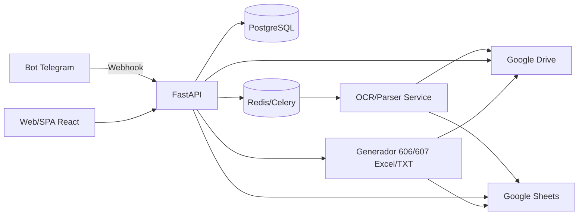
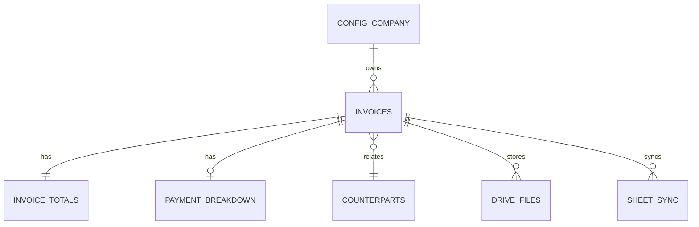

# Arquitectura y Diseño para Sistema de Facturación 606/607 (DGII)

## Objetivos
- Ingestar facturas (ventas y compras) vía web/app, carga directa o bot de Telegram.
- Procesar OCR y clasificación automática (606 compras/gastos, 607 ventas) con correcciones manuales.
- Persistir datos estructurados en base de datos, Google Sheets y archivos organizados en Google Drive.
- Generar exportaciones listas para los reportes oficiales 606 y 607 de la DGII (Excel/TXT) con validaciones fiscales.

## Arquitectura General
- **Frontend web**: React + Vite (SPA) con componentes para carga, edición y dashboards.
- **Backend API**: FastAPI (Python) por su rendimiento, tipado y ecosistema de librerías (pydantic, SQLModel/SQLAlchemy).
- **OCR y clasificación**: `pytesseract` o Google Cloud Vision; modelo ligero de clasificación (rules + ML opcional) para distinguir 606/607/notas.
- **Base de datos**: PostgreSQL (preferido) con soporte JSONB y funciones para validaciones; alternativa: MySQL.
- **Mensajería**: Telegram Bot API → webhook hacia FastAPI.
- **Almacenamiento de archivos**: Google Drive API (carpetas 606/607/AAAA/MM/RNC) y almacenamiento local/S3-compatible como caché.
- **Google Sheets**: API para hoja maestra “Control 606-607 – [negocio]” con pestañas 606_Compras, 607_Ventas y Resumen_mensual.
- **Servicios batch**: Workers (Celery/RQ + Redis) para OCR/parseo y exportación DGII.

### Diagrama de Componentes (mermaid)


## Modelo de Datos (Entidades y Relaciones)
Tabla principal `invoices` (aplica a 606 y 607):
- `id` (PK, UUID)
- `tipo_operacion` ENUM {`COMPRA_606`, `VENTA_607`}
- `tipo_documento` ENUM {`FACTURA`, `NOTA_CREDITO`, `NOTA_DEBITO`, `OTRO`}
- `rnc_emisor`, `nombre_emisor`
- `rnc_receptor`, `nombre_receptor`, `tipo_identificacion_receptor`
- `ncf`, `ncf_modificado`
- `fecha_comprobante` (date), `fecha_pago_retencion` (date nullable)
- `moneda` (ISO 4217), `tasa_cambio`
- `comentarios`
- `origen` ENUM {`WEB`, `TELEGRAM`, `API`}
- `file_url` (Drive), `file_mime`, `file_size`
- `ocr_status` ENUM {`PENDIENTE`, `PROCESADO`, `ERROR`}
- `validation_status` ENUM {`PENDIENTE`, `OBSERVADO`, `VALIDADO`}
- `created_at`, `updated_at`

Tabla `invoice_totals` (1-1 con invoices, desgloses monetarios):
- Para 606: campos de compra (bienes/servicios, ITBIS, retenciones, propina, forma_pago)
- Para 607: campos de venta (monto_facturado, ITBIS, retenciones, percibidos, propina, desglose pagos)

Tabla `payment_breakdown` (para 607):
- FK `invoice_id`
- `monto_efectivo`, `monto_cheque_transferencia_deposito`, `monto_tarjeta`, `monto_venta_credito`, `monto_bonos_certificados_regalo`, `monto_permuta`, `monto_otras_formas_venta`

Tabla `config_company`:
- `id` (PK)
- `rnc`, `razon_social`
- `maneja_606` (bool), `maneja_607` (bool)
- `series_ncf` (JSON array de prefijos y rangos)
- `telegram_bot_token`, `telegram_webhook_url`
- `google_credentials_secret` (referencia segura)

Tabla `counterparts` (proveedores/clientes):
- `id`, `tipo` ENUM {`PROVEEDOR`, `CLIENTE`, `AMBOS`}
- `rnc`, `nombre`, `tipo_identificacion`
- Contacto y metadatos.

Tabla `drive_files`:
- `id`, `invoice_id`, `drive_file_id`, `drive_path`, `file_name`, `mime_type`, `version`

Tabla `sheet_sync`:
- `id`, `invoice_id`, `sheet_row`, `sheet_tab`, `last_sync_at`, `sync_status`.

### Diagrama ER (simplificado)


### Esquema de tablas clave
#### invoices
| campo | tipo | notas |
| --- | --- | --- |
| id | uuid pk | |
| company_id | fk config_company | multi-empresa opcional |
| tipo_operacion | enum | `COMPRA_606` o `VENTA_607` |
| tipo_documento | enum | factura/nota crédito/nota débito |
| rnc_emisor | varchar(11) | |
| nombre_emisor | text | |
| rnc_receptor | varchar(11) | |
| nombre_receptor | text | |
| tipo_identificacion_receptor | enum | RNC/CEDULA/PASAPORTE/ID_TRIBUTARIA |
| ncf | varchar(19) | incluye e-CF |
| ncf_modificado | varchar(19) null | |
| fecha_comprobante | date | formato AAAA-MM-DD |
| fecha_pago_retencion | date null | |
| moneda | char(3) | ISO |
| tasa_cambio | numeric(14,6) | |
| origen | enum | WEB/TELEGRAM/API |
| ocr_status | enum | PENDIENTE/PROCESADO/ERROR |
| validation_status | enum | PENDIENTE/OBSERVADO/VALIDADO |
| comentarios | text | |
| created_at | timestamptz | |
| updated_at | timestamptz | |

#### invoice_totals (campos mínimos DGII)
Campos 606:
- `tipo_bien_servicio_comprado` (int)
- `monto_facturado_servicios`
- `monto_facturado_bienes`
- `total_monto_facturado`
- `itbis_facturado`
- `itbis_retenido`
- `itbis_sujeto_proporcionalidad`
- `itbis_llevado_al_costo`
- `itbis_por_adelantar`
- `itbis_percibido_en_compras`
- `tipo_retencion_isr`
- `monto_retencion_renta`
- `isr_percibido_en_compras`
- `impuesto_selectivo`
- `otros_impuestos_tasas`
- `monto_propina_legal`
- `forma_de_pago`

Campos 607:
- `tipo_ingreso`
- `monto_facturado`
- `itbis_facturado`
- `itbis_retenido_por_terceros`
- `itbis_percibido`
- `retencion_renta_por_terceros`
- `isr_percibido`
- `impuesto_selectivo`
- `otros_impuestos_tasas`
- `monto_propina_legal`

#### payment_breakdown (607)
- `monto_efectivo`
- `monto_cheque_transferencia_deposito`
- `monto_tarjeta`
- `monto_venta_credito`
- `monto_bonos_certificados_regalo`
- `monto_permuta`
- `monto_otras_formas_venta`

## Flujos Clave
### 1. Captura/Upload Web
1. Usuario selecciona archivo o ingresa datos manuales.
2. FastAPI recibe `POST /invoices` con metadata opcional.
3. Se almacena registro preliminar (`ocr_status=PENDIENTE`).
4. Archivo se sube a Google Drive en carpeta temporal del período detectado.
5. Se encola tarea OCR/parseo.
6. Worker ejecuta OCR, detecta RNC/NCF/fecha/montos, clasifica 606/607 y nota crédito/débito si NCF modificado.
7. Actualiza base de datos; ejecuta reglas de validación; cambia `validation_status`.
8. Sincroniza fila en Google Sheets (pestaña 606 o 607) y renombra/mueve archivo a la carpeta final `/Facturas/{606|607}/AAAA/MM/RNC/` con naming estándar.
9. Respuesta al usuario con resumen y alertas.

### 2. Flujo Telegram
1. Usuario envía/forward foto o PDF al bot.
2. Telegram → webhook FastAPI (`/telegram/webhook`).
3. Se descarga el archivo, se crea invoice preliminar (`origen=TELEGRAM`).
4. Se ejecutan pasos de OCR/validación iguales al flujo web.
5. Bot responde con:
   - Tipo de operación detectada (606/607).
   - RNC, NCF, fecha, montos clave.
   - Errores/alertas (NCF inválido, campos faltantes, montos inconsistente).

### 3. Exportación DGII (Excel/TXT)
1. Usuario elige período (AAAAMM) y tipo (606 o 607).
2. Servicio `exports.generate(periodo, tipo)` extrae datos validados del DB/Sheet.
3. Genera Excel con columnas en orden oficial; valida formatos y cuadres.
4. En fase 2, genera TXT cumpliendo especificaciones DGII (longitudes fijas, delimitadores, padding y validación de dígitos).
5. Guarda export en Drive y ofrece descarga en UI.

## Ejemplos de estructuras JSON
### 606 (compra)
```json
{
  "tipo_operacion": "COMPRA_606",
  "tipo_documento": "FACTURA",
  "rnc_emisor": "101234567",
  "nombre_emisor": "Proveedor SRL",
  "rnc_receptor": "201234567",
  "nombre_receptor": "Mi Negocio SRL",
  "ncf": "B0100000001",
  "fecha_comprobante": "2025-01-15",
  "moneda": "DOP",
  "totales": {
    "tipo_bien_servicio_comprado": 2,
    "monto_facturado_servicios": 5000,
    "monto_facturado_bienes": 0,
    "total_monto_facturado": 5000,
    "itbis_facturado": 900,
    "itbis_retenido": 0,
    "tipo_retencion_isr": "HONORARIOS",
    "monto_retencion_renta": 500,
    "impuesto_selectivo": 0,
    "otros_impuestos_tasas": 0,
    "monto_propina_legal": 0,
    "forma_de_pago": "CHEQUE_TRANSFERENCIA_DEPOSITO"
  }
}
```

### 607 (venta)
```json
{
  "tipo_operacion": "VENTA_607",
  "tipo_documento": "FACTURA",
  "rnc_emisor": "201234567",
  "nombre_emisor": "Mi Negocio SRL",
  "rnc_receptor": "101234567",
  "nombre_receptor": "Cliente SRL",
  "tipo_identificacion_receptor": "RNC",
  "ncf": "E3100000001",
  "fecha_comprobante": "2025-01-20",
  "moneda": "DOP",
  "totales": {
    "tipo_ingreso": 1,
    "monto_facturado": 12000,
    "itbis_facturado": 2160,
    "retencion_renta_por_terceros": 0,
    "impuesto_selectivo": 0,
    "monto_propina_legal": 0
  },
  "pagos": {
    "monto_efectivo": 2000,
    "monto_tarjeta": 5000,
    "monto_venta_credito": 6200,
    "monto_otras_formas_venta": 0
  }
}
```

## Validaciones fiscales mínimas
- **Formato NCF/e-CF**: prefijos válidos por tipo (B01, E31, etc.), longitud correcta y secuencia única por serie configurada.
- **Fechas**: `fecha_comprobante` y `fecha_pago_retencion` dentro del período y formato AAAAMMDD (o AAAA-MM-DD en DB, transformado al export).
- **Cuadre de montos**: suma de formas de pago = total con impuestos (607); montos de bienes + servicios = total sin impuestos (606); ITBIS calculado según tasa vigente.
- **Tipo de documento vs NCF**: notas de crédito/débito deben referenciar `ncf_modificado` y validar prefijos (ex: B04/E34 para notas de crédito).
- **RNC/Cédula**: validación de dígitos y longitud; alertar RNC repetido con NCF duplicado en el mismo período.
- **Retenciones**: si `tipo_retencion_isr` aplica, exigir `monto_retencion_renta`; coherencia entre `itbis_retenido` y tipo de proveedor.
- **Moneda/Tasa**: convertir a DOP para reportes; guardar tasa de cambio usada.
- **Estado de validación**: bloquear export si `validation_status` ≠ VALIDADO.

## Pseudocódigo y puntos críticos
### Webhook de Telegram
```python
@app.post("/telegram/webhook")
async def telegram_webhook(update: dict):
    message = parse_message(update)
    file_info = await download_telegram_file(message)
    invoice_id = create_invoice_stub(origen="TELEGRAM", file_info=file_info)
    enqueue_task("process_invoice", invoice_id)
    summary = await wait_for_quick_parse(invoice_id)
    reply_to_user(message.chat_id, summary)
```

### Proceso OCR y clasificación
```python
def process_invoice(invoice_id):
    invoice = db.get(invoice_id)
    text = run_ocr(invoice.file_path)
    parsed = parse_fields(text)  # regex + heurísticas + tablas de prefijos NCF
    tipo = classify(parsed)  # COMPRA_606 o VENTA_607
    update_invoice(invoice_id, parsed, tipo, ocr_status="PROCESADO")
    validate_invoice(invoice_id)
    sync_to_sheets(invoice_id)
    move_file_to_drive(invoice_id)
```

### Sincronización con Google Sheets
```python
def sync_to_sheets(invoice_id):
    inv = db.get_full(invoice_id)
    sheet = get_sheet(inv.tipo_operacion)
    row = map_invoice_to_row(inv)
    if inv.sheet_row:
        sheet.update_row(inv.sheet_row, row)
    else:
        inv.sheet_row = sheet.append_row(row)
    db.update_sheet_sync(inv.id, inv.sheet_row)
```

### Generación de export 606/607 (Excel/TXT)
```python
def generate_export(periodo: str, tipo: str, formato: str = "excel"):
    invoices = db.fetch_validated(periodo=periodo, tipo=tipo)
    rows = [map_invoice_to_dgii_row(i) for i in invoices]
    validate_rows(rows, tipo)
    if formato == "excel":
        return build_excel(rows, plantilla=tipo)
    else:
        return build_txt(rows, tipo)
```

## Estructura de carpetas en Google Drive
```
/Facturas/
  /606/
    /AAAA/
      /MM/
        /RNC_proveedor/
          tipo_op_RNC_NCF_fecha_monto.pdf
  /607/
    /AAAA/
      /MM/
        /RNC_cliente/
          tipo_op_RNC_NCF_fecha_monto.pdf
```

## UI y experiencia
- **Configuración inicial**: pantalla para RNC/razón social, series de NCF/e-CF, selección de 606/607.
- **Listado de facturas**: filtros por período, RNC, tipo_operacion; badges de estado OCR/validación.
- **Detalle**: campos editables con pre-fill OCR, vista previa del archivo, historial de sincronización.
- **Dashboard**: totales mensuales, ITBIS facturado/retenciones, progreso de exportación (checklist “listo para enviar”).

## Tecnologías recomendadas
- Backend: FastAPI + SQLModel/SQLAlchemy, Celery/RQ, Pydantic, python-telegram-bot, Google API Python Client.
- DB: PostgreSQL (JSONB para series de NCF), Redis para cola.
- Infra: contenedores Docker, despliegue en Fly.io/Render/Heroku o Kubernetes ligero.
- Observabilidad: logging estructurado, Sentry, métricas Prometheus.

